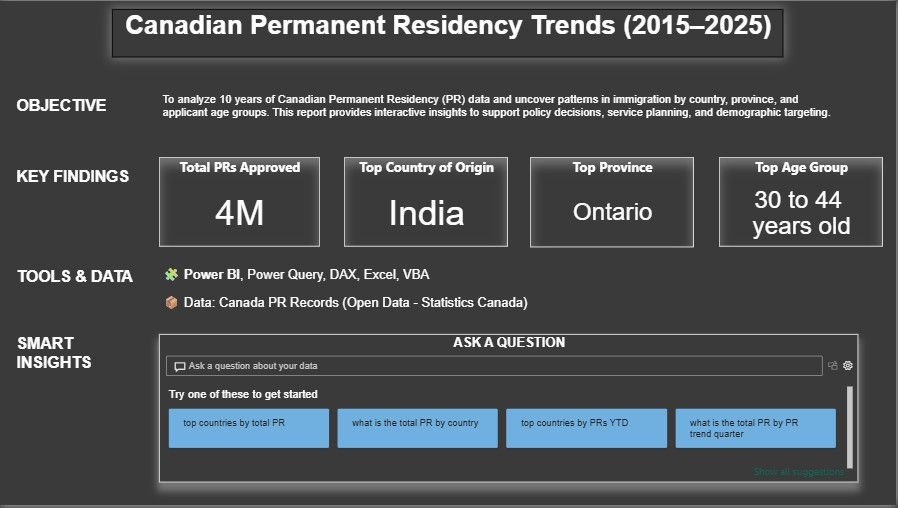
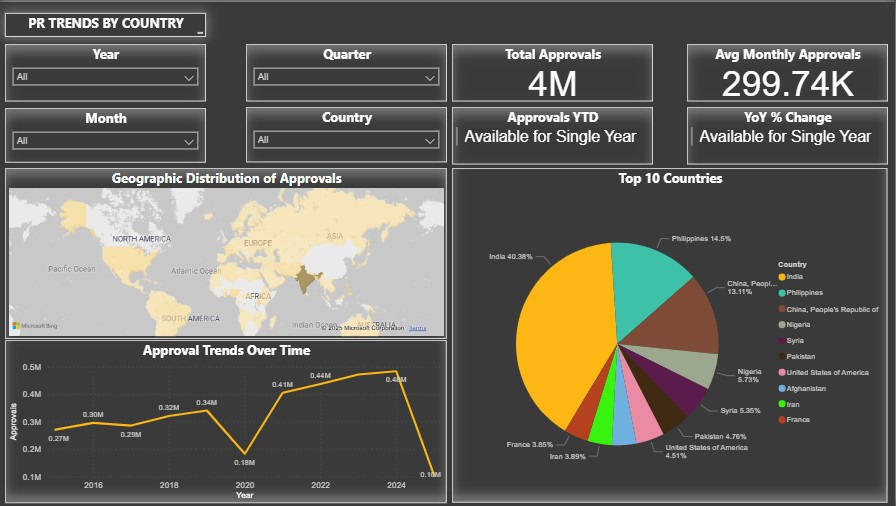
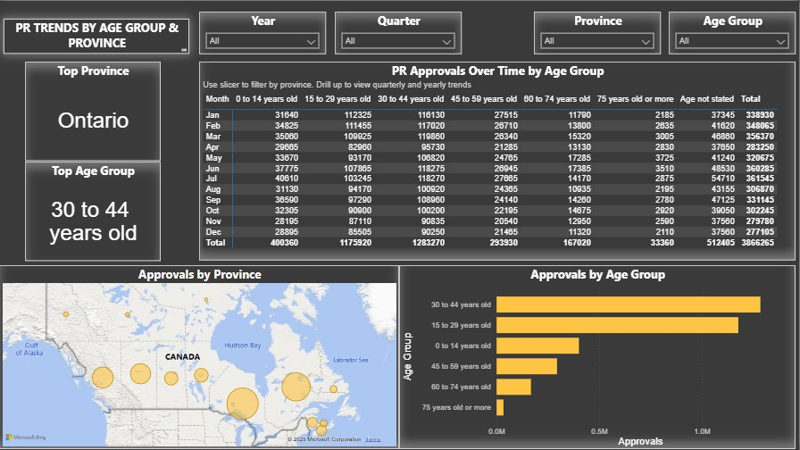

# Abdullah Ahmed  

Hello and welcome to my portfolio!

## 🧠 About Me  

I’m Abdullah, a dedicated data analyst/data scientist who loves diving into data to uncover the hidden stories it holds. Over the past two years, I’ve polished my skills in transforming raw data into meaningful insights that drive smarter decisions and tangible business results.

I enjoy tackling challenges head-on. They could range from designing interactive Power BI dashboards, streamlining ETL pipelines, or building machine learning models to solving complex  statistical problems. For me, it’s not just about working with data, but it’s about making it actionable and impactful.

Here’s a quick peek into my world:

- To me, data is more than numbers. It is a powerful tool to inspire decisions, improve efficiency, and unlock new opportunities.  
- I am genuinely fascinated by how AI, analytics, and cloud technology are shaping the future, and I am always exploring ways to push boundaries and learn something new.  
- When I am not working, you can often find me experimenting with new recipes, trying out different cuisines, exploring tech trends, or mentoring others. I also enjoy outdoor adventures and discovering hidden gems in the city.

I have worked on impactful analytics projects for clients like **Walmart**, **Ericsson**, **Nestlé**, and **FGF Brands**. My focus is on delivering business value through dashboards, forecasts, and interactive reports.

---

## 📊 My Tech Stack  
- **Business Intelligence Tools:** Tableau, Microsoft Power BI (Data Modelling, Reports, Dashboards), SSRS  
- **ETL & Workflow Orchestration Tools:** Apache Kafka, Microsoft SQL Server Integration Services (SSIS), Apache Airflow  
- **Programming Languages / Libraries:** Python (TensorFlow, NumPy, Pandas, Matplotlib, OpenCV, PySpark), R, C, HTML, CSS  
- **Cloud Platforms & Services:** Azure (Databricks, Data Factory, Synapse, ML Studio, Custom Vision, Speech Services)  
- **Databases & Data Warehousing:** MySQL, Microsoft SQL Server, MongoDB, Azure (SQL DB, Cosmos DB)  
- **Tools / Platforms:** GIT, Jira, PyCharm, Microsoft Excel (Formulas, Macros, VBA, Pivot Tables), Office 365, Salesforce  

---

## 📁 My Projects  

### 1. Canada PR Analytics Dashboard  
This dashboard provides a data-driven overview of Canada's Permanent Residency (PR) trends over the last decade. Built using Power BI, it visualizes quarterly trends by country, visa category, and region, helping policymakers, researchers, and applicants understand immigration dynamics.

[📥 PR Analytics - Canada ( 2015 - 2025 )`.pbix`]([https://onedrive.live.com/your-link-here](https://1drv.ms/u/c/f5a705bda4166878/ERLuZoInpW1Dili9l6vAQ7AB1Jhc0slsJAa7q5VJTElUWg?e=1I5M2I))

### Pages 

## Executive Summary

## Approvals by Country

## Approvals by Province & Age Group

---

## 📬 Contact Me  
- [LinkedIn](https://www.linkedin.com/in/abdu26399)
