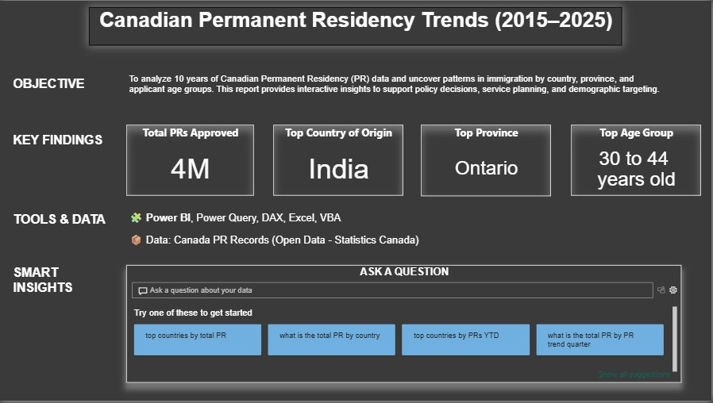

# Abdullah Ahmed  
Welcome to my data portfolio! I’m a Data Analyst with over 2 years of experience turning raw data into actionable insights using Power BI, SQL, and Python.

---

## 🧠 About Me  
With a background in Artificial Intelligence and a passion for data storytelling, I’ve worked on impactful analytics projects for clients like **Walmart**, **Ericsson**, **Nestlé**, and **FGF Brands**. My focus is on delivering business value through dashboards, forecasts, and interactive reports.

---

## 📊 Skills  
- **Business Intelligence**: Microsoft Power BI, DAX, Power Query  
- **Data Engineering**: SQL, Azure Data Factory, Databricks, SSIS  
- **Programming**: Python (Pandas, NumPy, TensorFlow)  
- **Cloud**: Microsoft Azure  
- **Version Control**: Git, GitHub  
- **Workflow & Methodology**: Agile, Scrum  

---

## 📁 Dashboards  

### Canada PR Analytics Dashboard  
This dashboard provides a data-driven overview of Canada's Permanent Residency (PR) trends over the last decade. Built using Power BI, it visualizes quarterly trends by country, visa category, and region, helping policymakers, researchers, and applicants understand immigration dynamics.

[📥 PR Analytics - Canada ( 2015 - 2025 )`.pbix`]([https://onedrive.live.com/your-link-here](https://1drv.ms/u/c/f5a705bda4166878/ERLuZoInpW1Dili9l6vAQ7AB1Jhc0slsJAa7q5VJTElUWg?e=1I5M2I))

### Pages 

## Executive Summary

## Approvals by Country

## Approvals by Province & Age Group

---

## 📬 Contact Me  
- [LinkedIn](https://www.linkedin.com/in/abdu26399)
